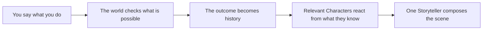

<p align="center">
  
</p>

<h1 align="center">Harness Tavern</h1>

<p align="center">
  <strong>As easy as chatting in a tavern. Deep enough for stories with memory, secrets, and consequences.</strong><br>
  An open-source, local-first roleplaying tool where Characters keep private minds and choices become durable history.
</p>

<p align="center">
  <a href="https://github.com/HenryQUQ/harness-tavern/actions/workflows/ci.yml"></a>
  <a href="LICENSE"></a>
  <a href="package.json"></a>
  
</p>

<p align="center">
  <a href="README.zh-CN.md">简体中文</a> ·
  <a href="#start-locally">Try the Tavern</a> ·
  <a href="docs/README.md">Read the docs</a> ·
  <a href="https://github.com/HenryQUQ/harness-tavern/discussions">Pull up a chair</a>
</p>

---

Open a Story, say what you do, and receive one coherent scene. Harness Tavern feels familiar because the conversation stays simple. Under the floorboards, however, it records what became true, keeps each Character's knowledge separate, and carries unresolved intentions into the next turn.

**The conversation is the doorway into the world. It is not the database of truth.**

## The promise

| The world has… | So the story can… |
|---|---|
| **Memory** | Remember opened doors, changed relationships, unfinished goals, and promises after they leave the chat window—or after you change models. |
| **Secrets** | Give every relevant Character a private perspective, so knowledge is revealed deliberately instead of leaking between prompts. |
| **Consequences** | Resolve actions against authored rules before narration, so failure remains failure and prose cannot quietly rewrite history. |

Player agency is part of that promise. The AI cannot invent your dialogue, thoughts, feelings, consent, or a successful action you never took. Timelines can branch for a “what if?” without contaminating the Playthrough they came from.

## One turn inside the Tavern



Models help interpret intent, inhabit Characters, and write the scene. Deterministic application code owns authoritative effects. That separation is what lets the prose stay imaginative without making the world's memory disposable.

## A Story is a whole playable world

A **Story** is more than a prompt or transcript. It keeps everything needed to play together:

- a narrator-only, single-actor, or ensemble Cast;
- public identity, private context, beliefs, emotions, relationships, intent, and reveal policy for each Character;
- Lore, Scenes, prompt layers, examples, safe transforms, and declarative automations;
- Actions, preconditions, effects, Observations, Agendas, clocks, and visibility rules;
- opening routes plus an editable `harness-tavern-story/v2` source that can be validated, versioned, and shared.

Small Stories fit in one JSON file. Larger projects can use a folder of Character Cards, Lorebooks, Markdown Scenes, Actions, and Agendas. Authored sources remain separate from Playthrough events, so editing a Story does not rewrite what already happened.

## What is already playable

| You can… | What that means |
|---|---|
| Play a living ensemble | Any number of Cast members may speak, act, react, observe, or stay silent inside one Storyteller beat. |
| Continue a long Playthrough | Recent history, rolling continuity summaries, and deterministic local retrieval recall older relevant material without replaying the entire transcript. |
| See what the world believes | The Story Engine exposes player-visible facts, action results, ongoing intent, and branch-safe Timelines. |
| Author without a hidden creative prompt | Create a blank standard Story or import portable content, then edit every owned field directly. Opinionated creation can remain an explicit extension. |
| Choose your own AI | Connect DeepSeek, OpenRouter, Anthropic, Gemini, Azure OpenAI, local models, or compatible APIs and switch without rebuilding Stories or saves. |
| Bring supporting material | Attach bounded images and documents to a turn. Capable providers receive images; other models fail closed to safe metadata or extracted text. |
| Move an existing library | Preview SillyTavern cards, chats, groups, World Info, Personas, and compatible presets before anything is written. |
| Share without sharing everything | Export editable Stories, playable Tavern packs, sanitized public previews, portable Playthroughs, or credential-free backups. |

## Start locally

You need [Node.js 22.19 or newer](https://nodejs.org/) and Git.

```bash
git clone https://github.com/HenryQUQ/harness-tavern.git
cd harness-tavern
npm ci
npm start
```

Open **http://127.0.0.1:8787**.

The first visit creates a default Persona and the three-member ensemble Story **Midnight at the Glass Observatory**, but no model connection or dummy Conversation. Open **Settings → AI Connections** and connect a supported service before beginning a Playthrough. Credentials are encrypted locally.

Harness Tavern does not bundle a model. Story authoring, import, migration, and library management remain available without a provider; generation requires a service you explicitly connect.

For connection details, backups, troubleshooting, and a guided first Playthrough, read [Getting started](docs/GETTING_STARTED.md).

## Bring your SillyTavern library

Open **Settings → Import from SillyTavern** and select a Character Card, backup ZIP, or user-data directory. Harness Tavern always previews the migration plan before writing anything.

Each compatible Character Card becomes a single-cast Story, Groups become ensemble Stories, World Info becomes narrator-only Stories, and Chats become Story Playthroughs. Personas and compatible generation presets are retained. Advanced World Info activation and safe Regex semantics are normalized; plain manual Quick Replies become declarative composer actions; source vectors are rebuilt locally. Secrets are excluded, and scripts or untrusted extension code are never executed.

See the complete [migration guide](docs/MIGRATION.md).

## Build this Tavern with us

Harness Tavern is a working beta, not a finished answer to roleplaying. The difficult and interesting parts deserve more than one perspective. You can join before you have a polished proposal or a patch.

| If you care about… | A useful way to join |
|---|---|
| Memorable play | Share a redacted moment where continuity, agency, pacing, or character behavior felt right—or broke. |
| Story craft | Test the Story format, write an example, challenge Action and Agenda authoring, or improve creator guidance. |
| Calm, approachable interfaces | Help make deep world state feel like a welcoming conversation instead of a control panel. |
| Runtime engineering | Work on Events, projections, retrieval, Character isolation, deterministic consequences, or resumable turns. |
| Model freedom | Improve provider adapters, capability handling, local-model support, and captured protocol tests. |
| Trust and portability | Review privacy boundaries, imports, public projections, backups, schemas, and extension safety. |

Some questions we would especially like to explore together:

- How should players inspect or correct long-term memory without turning a Story into database administration?
- How can private knowledge be trustworthy and debuggable without spoiling the secret?
- How can authors create meaningful consequences without programming every possible sentence?
- What makes an ensemble feel alive without forcing every Character to speak every turn?
- Which parts of a Story should become an interoperable format across tools and models?

<p align="center">
  <strong>Bring a question, a rough sketch, a failing scene, or a small patch.</strong><br>
  <a href="https://github.com/HenryQUQ/harness-tavern/discussions">Start a conversation in GitHub Discussions →</a>
</p>

The [contribution guide](CONTRIBUTING.md) offers several ways in. The longer [developer guide](docs/DEVELOPMENT.md) explains the contracts behind memory, secrecy, consequences, portability, and failure recovery.

## Local ownership and honest limits

- Runtime data lives in `~/.harness-tavern` by default.
- Provider keys are encrypted at rest and excluded from portable backups.
- Public previews use a separate player-safe snapshot, not the private creator record.
- Imported extensions are declarative; executable fields are rejected.
- Accepted narration is never silently cut at an application character limit. Incomplete provider output suspends the turn instead of masquerading as a finished reply.

Version 0.16.0 is a **local-first, single-owner beta**. It is ready for real local roleplay, Story authoring, migration, and continued development, but it is not an audited multi-tenant hosted service. Read [Security](docs/SECURITY.md) and [Operations](docs/OPERATIONS.md) before exposing it beyond your own machine.

## Find your way around

| I want to… | Start here |
|---|---|
| Install and enter a Story | [Getting started](docs/GETTING_STARTED.md) |
| Author a complete Story | [Content authoring guide](docs/CREATOR_GUIDE.md) |
| Move from SillyTavern | [Migration guide](docs/MIGRATION.md) |
| Edit Story files directly | [Story source guide](docs/STORY_SOURCES.md) |
| Understand the runtime | [Architecture](docs/ARCHITECTURE.md) |
| Join development | [Developer guide](docs/DEVELOPMENT.md) |
| Browse every document | [Documentation home](docs/README.md) |

## Community

- Use [GitHub Discussions](https://github.com/HenryQUQ/harness-tavern/discussions) for questions, playtest notes, design sketches, and ideas that still need shaping.
- Use [GitHub Issues](https://github.com/HenryQUQ/harness-tavern/issues) for reproducible bugs or features with a clear acceptance boundary.
- Read [CONTRIBUTING.md](CONTRIBUTING.md) before opening a pull request.
- Report security issues privately through [SECURITY.md](SECURITY.md).

If the idea resonates, share the project or invite someone whose perspective is missing from the table.

Harness Tavern is independently maintained and released under the [MIT License](LICENSE).
