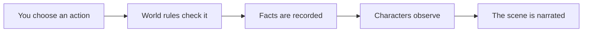

<p align="center">
  
</p>

<h1 align="center">Harness Tavern</h1>

<p align="center">
  <strong>Roleplay worlds that remember what actually happened.</strong><br>
  A local-first home for persistent characters, causal stories, and AI freedom.
</p>

<p align="center">
  <a href="https://github.com/HenryQUQ/harness-tavern/actions/workflows/ci.yml"></a>
  <a href="LICENSE"></a>
  <a href="package.json"></a>
  
</p>

<p align="center">
  <a href="README.zh-CN.md">简体中文</a> ·
  <a href="docs/GETTING_STARTED.md">Get started</a> ·
  <a href="docs/README.md">Documentation</a> ·
  <a href="https://github.com/HenryQUQ/harness-tavern/discussions">Community</a>
</p>

---

Harness Tavern is for people who want a character or story to remain coherent after the chat window becomes long. It remembers doors that were opened, promises that were made, secrets that are still private, and intentions that have not yet been resolved.

The conversation is how you experience the story. It is not the database of truth.

## Why it feels different

Most roleplay frontends ask a model to produce a plausible next message from text history. Harness Tavern first decides what the world allows, records the result, shows each character only what they can observe, and then asks the model to narrate it.



That gives you:

- **Persistent worlds** — facts, relationships, goals, and commitments survive model changes.
- **Characters with direction** — ongoing intentions continue until events actually resolve them.
- **Fair player control** — the AI cannot invent your dialogue, thoughts, feelings, or a successful action for you.
- **Private knowledge** — a character does not automatically know another character's secrets.
- **Real consequences** — impossible actions can fail without the narration quietly pretending they worked.
- **Safe branches** — explore a “what if?” timeline without overwriting the original story.

## What you can do

| Experience | What it means for you |
|---|---|
| Meet a character | Start with an editable character profile and keep the relationship across sessions. |
| Enter a story | Play narrator-only, single-character, or ensemble stories through the same simple interface. |
| Edit anything you authored | Reopen any Character or Story and change its voice, private intent, Cast, Lore, Scenes, Actions, Agendas, or metadata. |
| Author without a fixed generator | Start from a blank standard structure or import a portable file, then edit every field directly. The core never expands a brief with a built-in creative prompt. |
| Choose any AI | Switch between connected APIs and models without changing your characters or saves. |
| Tune the response | Use presets for style, sampling, reasoning strength, initiative, and context behavior. |
| Bring your library | Preview and migrate compatible SillyTavern characters, chats, groups, worlds, personas, and presets. |
| Share your work | Export editable Story files, playable Tavern packs, public previews, or portable playthroughs. |

## Start locally

You need [Node.js 22.19 or newer](https://nodejs.org/) and Git.

```bash
git clone https://github.com/HenryQUQ/harness-tavern.git
cd harness-tavern
npm ci
npm start
```

Open **http://127.0.0.1:8787**.

No API key is needed for the first visit. Harness Tavern includes an offline demo connection, a default Persona, three example characters, and the ensemble story **Midnight at the Glass Observatory**. It does not create a dummy conversation.

For a guided walkthrough, connection setup, migration, backups, and troubleshooting, read [Getting started](docs/GETTING_STARTED.md).

## Your first few minutes

1. Tell the Tavern what it should call you.
2. Choose **Meet a character**, **Enter a story**, or open **Library → New** for a blank Character or Story.
3. Try an action and open the Story Engine panel to see known facts, visible action results, ongoing intent, and timelines.
4. When you are ready, open **Settings → AI Connections** to add your preferred service.
5. Open the model menu inside a chat to switch API, model, or response preset.

The built-in demo keeps onboarding simple. A real provider is optional and can be added later without recreating your library.

## Bring your SillyTavern library

Open **Settings → Import from SillyTavern** and select a Character Card, backup ZIP, or user-data directory. Harness Tavern always previews the plan before writing anything.

It can migrate compatible Characters, Chats, Group Chats, Groups, World Info, Personas, and generation presets. Secrets are excluded. Extensions, Quick Replies, themes, and vector indexes may be inventoried, but untrusted code is never executed.

See the full [migration guide](docs/MIGRATION.md).

## Stories remain yours

Every Story has an editable `harness-tavern-story/v2` source:

- use one self-contained JSON file for a compact Story;
- use a folder of Character, Lorebook, Markdown Scene, Action, and Agenda files for a larger project;
- edit with the built-in editor or any text editor;
- validate and version the files with Git;
- export without provider credentials or local database identifiers.

The visual Character and Story workspaces cover the complete authored model. System identifiers, causal event history, and saved playthrough facts remain separate and read-only, so editing the work never rewrites what already happened in a playthrough.

Library creation is intentionally structural: it asks only for the minimum identity and references needed to create a valid blank file. Genre, personality, prose, Scenes, and causal rules stay empty until you explicitly author or import them. Opinionated assistance can live in an optional extension, but it is not a hidden policy of the core.

This keeps authored content separate from conversations and playthrough state. Learn more in [Editable Story sources](docs/STORY_SOURCES.md) or open the [included multi-file example](examples/stories/midnight-at-the-glass-observatory/story.tavern.json).

## Privacy and honest limits

- Runtime data lives in `~/.harness-tavern` by default.
- Provider keys are encrypted at rest and are excluded from portable backups.
- Public previews contain a separate player-safe snapshot, not the private creator record.
- Imported extensions are declarative; executable fields are rejected.
- Harness Tavern does not silently cut accepted narration at an application character limit. If a provider returns an incomplete result, the turn is suspended instead of displaying partial prose as a completed reply.

Version 0.13.0 is a **local-first, single-owner beta**. It is ready for real local roleplay, content authoring, migration, and continued development, but it is not an audited multi-tenant hosted service. Read [Security](docs/SECURITY.md) and [Operations](docs/OPERATIONS.md) before exposing it beyond your own machine.

## Documentation

| I want to… | Start here |
|---|---|
| Install and use the Tavern | [Getting started](docs/GETTING_STARTED.md) |
| Author a Character or Story | [Content authoring guide](docs/CREATOR_GUIDE.md) |
| Move from SillyTavern | [Migration guide](docs/MIGRATION.md) |
| Edit Story files directly | [Story source guide](docs/STORY_SOURCES.md) |
| Understand the project or contribute | [Developer guide](docs/DEVELOPMENT.md) |
| Browse every document | [Documentation home](docs/README.md) |

## Community

- Ask setup and design questions in [GitHub Discussions](https://github.com/HenryQUQ/harness-tavern/discussions).
- Report reproducible bugs or propose scoped features in [GitHub Issues](https://github.com/HenryQUQ/harness-tavern/issues).
- Read [CONTRIBUTING.md](CONTRIBUTING.md) before opening a pull request.
- Report security issues privately through the process in [SECURITY.md](SECURITY.md).

Harness Tavern is independently maintained and released under the [MIT License](LICENSE).
