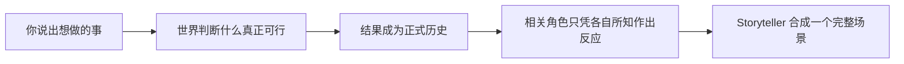

<p align="center">
  
</p>

<h1 align="center">Harness Tavern</h1>

<p align="center">
  <strong>像走进酒馆一样轻松开口。让故事真正有记忆、有秘密、有后果。</strong><br>
  一个本地优先的开源角色扮演工具：角色拥有彼此独立的心智，你的选择会成为不会被随意改写的历史。
</p>

<p align="center">
  <a href="https://github.com/HenryQUQ/harness-tavern/actions/workflows/ci.yml"></a>
  <a href="LICENSE"></a>
  <a href="package.json"></a>
  
</p>

<p align="center">
  <a href="README.md">English</a> ·
  <a href="#在本地开始">进入酒馆</a> ·
  <a href="docs/README.md">阅读文档</a> ·
  <a href="https://github.com/HenryQUQ/harness-tavern/discussions">来桌边坐坐</a>
</p>

---

打开一个 Story，说出你想做的事，然后收到一个连贯场景。Harness Tavern 的表面刻意保持简单，使用起来仍然像自然聊天；但在木地板下面，它会记录什么已经成为事实，把每个角色知道的内容彼此隔离，并让尚未解决的意图继续走进下一回合。

**对话是进入世界的大门，却不是世界事实的账本。**

## 这个酒馆的承诺

| 世界拥有…… | 故事才能…… |
|---|---|
| **记忆** | 在信息离开聊天窗口、甚至切换模型以后，仍然记得打开的门、变化的关系、未完成的目标与做过的承诺。 |
| **秘密** | 让每个相关角色只从自己的私有视角行动，信息需要经过真正的透露，而不是在 Prompt 之间悄悄泄漏。 |
| **后果** | 在叙事之前按照作者规则结算行动，因此失败仍然是失败，优美的文字也不能私自篡改历史。 |

玩家自主权也是这份承诺的一部分。AI 不能擅自替你说话、思考、感受、同意，或宣布你没有做过的行动已经成功。你可以创建“如果当时……”的 Timeline，而不会污染它所来自的 Playthrough。

## 一个回合在酒馆里如何发生



模型负责理解意图、进入角色并写出场景；确定性的应用代码负责权威效果。正是这层分工，让文字可以保持自由想象，又不会让世界的记忆变成一次性消耗品。

## 一个 Story 就是一整个可玩世界

**Story** 不只是 Prompt 或聊天记录。它会把游玩所需的内容放在一起：

- 纯旁白、单角色或多人组成的 Cast；
- 每个角色的公开身份、私有背景、信念、情绪、关系、意图与秘密透露策略；
- Lore、Scene、提示层、示例、安全文本变换与声明式自动提示；
- Action、前置条件、效果、Observation、Agenda、时钟与可见性规则；
- 开场路线，以及可验证、可版本管理、可分享的 `harness-tavern-story/v2` 源文件。

小型 Story 可以放在一个 JSON 文件中，大型项目则可以拆成 Character Card、Lorebook、Markdown Scene、Action 和 Agenda 文件。作者源文件与 Playthrough 事件彼此分离，因此修改 Story 不会重写一次游玩中已经发生的事情。

## 现在已经可以做什么

| 你可以…… | 实际意味着什么 |
|---|---|
| 游玩真正的多人场景 | 任意数量的 Cast 成员可以在同一个 Storyteller 叙事拍中说话、行动、反应、观察，或选择沉默。 |
| 继续很长的 Playthrough | 最近历史、滚动连续性摘要与确定性本地检索会召回更早的相关内容，不必把整段聊天重复塞给模型。 |
| 看见世界认定的事实 | Story Engine 会展示玩家可见的事实、行动结果、持续意图与分支安全的 Timeline。 |
| 在没有隐藏创作 Prompt 的情况下写故事 | 新建空白标准 Story 或导入便携内容，然后直接编辑所有作者字段；带有创作立场的辅助能力可以保持为显式扩展。 |
| 自由选择 AI | 连接 DeepSeek、OpenRouter、Anthropic、Gemini、Azure OpenAI、本地模型或兼容 API，切换时不需要重建 Story 和存档。 |
| 为场景提供材料 | 每回合可以附带受限图片与文档；支持视觉的 Provider 会收到图片，其他模型只会得到安全元数据或可提取文本。 |
| 迁移已有资料库 | 在真正写入前预览 SillyTavern 角色卡、聊天、群组、World Info、Persona 与兼容预设。 |
| 分享作品而不分享一切 | 导出可编辑 Story、可玩 Tavern Pack、经过脱敏的公开预览、便携 Playthrough 或不含凭据的备份。 |

## 在本地开始

需要安装 [Node.js 22.19 或更新版本](https://nodejs.org/)和 Git。

```bash
git clone https://github.com/HenryQUQ/harness-tavern.git
cd harness-tavern
npm ci
npm start
```

打开 **http://127.0.0.1:8787**。

第一次启动会创建默认玩家 Persona，以及包含三名 Cast 成员的多人 Story **Midnight at the Glass Observatory**，但不会创建模型连接或 dummy Conversation。开始 Playthrough 前，请打开 **Settings → AI Connections** 连接一个支持的服务；凭据只在本机加密保存。

Harness Tavern 不内置模型。没有 Provider 时仍可创作、导入、迁移和管理 Story；生成回复时必须使用你明确连接的服务。

模型连接、备份、排错与第一次游玩的完整引导，请阅读[开始使用](docs/GETTING_STARTED.md)。

## 带入 SillyTavern 内容

打开 **Settings → Import from SillyTavern**，选择 Character Card、备份 ZIP 或用户数据目录。真正写入前，Harness Tavern 一定会先展示迁移计划。

每张兼容 Character Card 会成为单角色 Story，Group 会成为多人 Story，World Info 会成为纯旁白 Story，Chat 会成为相应 Story 的 Playthrough。Persona 与兼容生成预设也会保留。高级 World Info 激活和安全 Regex 语义会被归一化，纯文本手动 Quick Reply 会变成声明式输入按钮，源内容向量会在本地重建。密钥始终排除，脚本与陌生扩展代码绝不会执行。

详细兼容范围请查看[迁移指南](docs/MIGRATION.md)。

## 和我们一起建造这间酒馆

Harness Tavern 已经是可以运行的 Beta，但还不是角色扮演问题的最终答案。真正困难也真正有趣的部分，需要更多不同视角。你不必等到拥有完整方案或代码以后才加入。

| 如果你在意…… | 可以这样加入 |
|---|---|
| 值得记住的游玩体验 | 分享一个经过脱敏的时刻：连续性、玩家自主权、节奏或角色行为哪里很自然，哪里突然失效。 |
| 故事创作 | 试用 Story 格式、补充示例、挑战 Action / Agenda 的编辑方式，或改进创作者文档。 |
| 安静而容易接近的界面 | 帮助深层世界状态看起来仍像一场欢迎任何人加入的对话，而不是复杂控制台。 |
| Runtime 工程 | 参与 Event、Projection、检索、角色心智隔离、确定性后果或可恢复回合。 |
| 模型自由 | 改进 Provider 适配、能力判断、本地模型支持与协议捕获测试。 |
| 信任与可携带性 | 审查隐私边界、导入、公开投影、备份、Schema 与扩展安全。 |

我们尤其希望和更多人一起讨论这些问题：

- 怎样让玩家查看或修正长期记忆，同时又不把故事变成数据库管理？
- 怎样让私有知识可以被信任、被调试，却不会提前剧透秘密？
- 怎样让作者创造真正的后果，而不需要为玩家的每句话编程？
- 怎样让多人 Cast 显得鲜活，却不强迫每个角色在每回合发言？
- Story 的哪些部分应该成为跨工具、跨模型的开放互操作格式？

<p align="center">
  <strong>带上一个问题、一张草图、一次失败的场景，或一个很小的 Patch 都可以。</strong><br>
  <a href="https://github.com/HenryQUQ/harness-tavern/discussions">在 GitHub Discussions 开始一桌新话题 →</a>
</p>

[贡献指南](CONTRIBUTING.md)提供了几种参与方式；更完整的[开发者指南](docs/DEVELOPMENT.md)会解释记忆、秘密、后果、可携带性与故障恢复背后的工程契约。

## 本地所有权与真实边界

- 默认运行数据保存在 `~/.harness-tavern`。
- Provider Key 会加密保存，并且不会进入便携备份。
- 公开预览使用单独生成的玩家安全快照，不会读取完整创作者记录。
- 可导入扩展必须是声明式内容；包含可执行字段时会被拒绝。
- 已接受的叙事不会被应用字符数静默截断；Provider 输出不完整时，本轮会暂停，而不是把残缺文字伪装成完整回复。

0.16.0 是一个**本地优先、单 Owner Beta**。它已经可以用于真实的本地角色扮演、Story 编辑、迁移和继续开发，但不是经过独立安全审计的多租户托管服务。把它暴露到本机以外之前，请阅读[安全设计](docs/SECURITY.md)和[运维指南](docs/OPERATIONS.md)。

## 找到你的入口

| 我想要…… | 从这里开始 |
|---|---|
| 安装并进入一个 Story | [开始使用](docs/GETTING_STARTED.md) |
| 编辑完整 Story | [内容编辑指南](docs/CREATOR_GUIDE.md) |
| 从 SillyTavern 迁移 | [迁移指南](docs/MIGRATION.md) |
| 直接编辑 Story 文件 | [Story Source 指南](docs/STORY_SOURCES.md) |
| 理解 Runtime | [系统架构](docs/ARCHITECTURE.md) |
| 参与开发 | [开发者指南](docs/DEVELOPMENT.md) |
| 浏览全部文档 | [文档中心](docs/README.md) |

## 社区

- 问题、游玩观察、设计草图与还需要一起打磨的想法，请带到 [GitHub Discussions](https://github.com/HenryQUQ/harness-tavern/discussions)。
- 可复现缺陷或边界清晰的功能建议，请提交到 [GitHub Issues](https://github.com/HenryQUQ/harness-tavern/issues)。
- 提交 Pull Request 前，请阅读 [CONTRIBUTING.md](CONTRIBUTING.md)。
- 安全问题请按照 [SECURITY.md](SECURITY.md) 私下报告。

如果你也认同这个方向，欢迎把项目分享给朋友，或邀请一种目前还没有出现在桌边的视角。

Harness Tavern 由独立维护者维护，并采用 [MIT License](LICENSE)。
