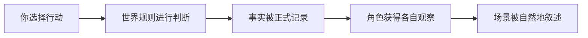

<p align="center">
  
</p>

<h1 align="center">Harness Tavern</h1>

<p align="center">
  <strong>让角色扮演世界真正记得发生过什么。</strong><br>
  一个本地优先、角色持续、故事有因果、模型可自由切换的下一代酒馆。
</p>

<p align="center">
  <a href="https://github.com/HenryQUQ/harness-tavern/actions/workflows/ci.yml"></a>
  <a href="LICENSE"></a>
  <a href="package.json"></a>
  
</p>

<p align="center">
  <a href="README.md">English</a> ·
  <a href="docs/GETTING_STARTED.md">开始使用</a> ·
  <a href="docs/README.md">完整文档</a> ·
  <a href="https://github.com/HenryQUQ/harness-tavern/discussions">社区讨论</a>
</p>

---

Harness Tavern 面向那些希望角色和故事在长对话之后依然保持一致的用户。它会记住已经打开的门、做出的承诺、仍未公开的秘密，以及尚未完成的角色意图。

对话是你体验故事的方式，但不再是系统判断事实的唯一依据。

## 为什么体验不同

传统角色扮演前端主要让模型根据文字历史“合理续写”。Harness Tavern 会先判断世界规则是否允许当前行动，记录真实结果，把每个角色能够观察到的内容分别交给他们，最后才生成叙事。



因此你会得到：

- **持续存在的世界**——事实、关系、目标和承诺不会因为切换模型而消失。
- **有长期方向的角色**——角色意图会持续存在，直到事件真正让它完成、失败或暂停。
- **属于玩家的自主权**——AI 不能擅自替你说话、思考、感受，或宣布你的行动已经成功。
- **彼此隔离的秘密**——一个角色不会无缘无故知道其他角色的私人信息。
- **真实行动后果**——不可能的行动可以失败，叙事不能偷偷把失败写成成功。
- **安全的故事分支**——可以创建“如果当时……”时间线，而不会覆盖原本经历。

## 你可以做什么

| 体验 | 对普通用户意味着什么 |
|---|---|
| 认识角色 | 从可编辑角色档案开始，让关系与记忆跨会话持续。 |
| 进入故事 | 用同一种简单界面游玩纯旁白、单角色或多人故事。 |
| 随时修改内容 | 重新打开任意角色或故事，修改声音、私人意图、阵容、Lore、Scene、Action、Agenda 与元数据。 |
| 不依赖固定生成器 | 从空白标准结构开始，或导入便携文件，再直接编辑每个字段。内核不会用内置创作 Prompt 扩写 brief。 |
| 自由选择 AI | 在不同 API 与模型之间切换，不需要重建角色和存档。 |
| 调整回复方式 | 用预设管理风格、采样、思考强度、主动性和上下文策略。 |
| 迁移已有内容 | 先预览，再迁移兼容的 SillyTavern 角色、聊天、群组、世界书、Persona 和预设。 |
| 分享自己的作品 | 导出可编辑 Story、可玩 Tavern Pack、公开预览或可继续游玩的存档。 |

## 在本地开始

需要安装 [Node.js 22.19 或更新版本](https://nodejs.org/)和 Git。

```bash
git clone https://github.com/HenryQUQ/harness-tavern.git
cd harness-tavern
npm ci
npm start
```

打开 **http://127.0.0.1:8787**。

第一次使用不需要 API Key。Harness Tavern 内置离线演示连接、默认玩家 Persona、三名示例角色，以及多人故事 **Midnight at the Glass Observatory**，同时不会自动创建 dummy 对话。

更完整的安装、连接模型、迁移、备份与排错说明，请阅读[开始使用](docs/GETTING_STARTED.md)。

## 最初几分钟

1. 告诉酒馆应该怎么称呼你。
2. 选择**认识角色**、**进入故事**，或通过 **Library → New** 建立空白角色 / 故事。
3. 尝试一个行动，再打开 Story Engine 面板查看已知事实、行动结果、持续意图和时间线。
4. 准备好后，在 **Settings → AI Connections** 中加入自己常用的 AI 服务。
5. 在聊天顶部打开模型菜单，随时切换 API、模型或回复预设。

内置演示模型负责让第一次体验足够简单。真实 API 可以稍后再连接，不会影响已经创建的角色和故事。

## 带入 SillyTavern 内容

打开 **Settings → Import from SillyTavern**，选择 Character Card、备份 ZIP 或用户数据目录。真正写入前，Harness Tavern 一定会先显示迁移计划。

兼容内容包括 Characters、Chats、Group Chats、Groups、World Info、Personas 和生成预设。密钥始终排除；扩展、Quick Replies、主题与向量索引只会进入清单，不会执行其中的陌生代码。

详细兼容范围请查看[迁移指南](docs/MIGRATION.md)。

## 故事文件属于你

每个 Story 都有可编辑的 `harness-tavern-story/v2` 源文件：

- 小型故事可以放在一个自包含 JSON 文件中；
- 大型项目可以拆成 Character、Lorebook、Markdown Scene、Action 和 Agenda 文件；
- 可以使用内置编辑器，也可以直接使用任何文本编辑器；
- 可以使用 Git 保存和审查每次改动；
- 导出内容不会携带 Provider 凭据或本地数据库 ID。

角色与故事可通过完整的可视化工作台持续编辑。系统 ID、因果事件历史与已经发生的存档事实保持独立只读，因此修改内容本身不会篡改某次游玩中已经发生的事情。

Library 的新建流程刻意只负责结构：它仅询问形成有效空白文件所需的最小身份与引用。题材、性格、正文、Scene 与因果规则会保持为空，直到你明确填写或导入。带有创作立场的辅助能力可以由可选扩展提供，但不会成为内核里的隐藏策略。

这样，创作者写下的故事与玩家的对话、存档状态彼此分离。你可以继续阅读[可编辑 Story 文件](docs/STORY_SOURCES.md)，或直接查看仓库中的[多文件示例](examples/stories/midnight-at-the-glass-observatory/story.tavern.json)。

## 隐私与真实边界

- 默认运行数据保存在 `~/.harness-tavern`。
- Provider Key 会加密保存，并且不会进入便携备份。
- 公开预览使用单独生成的玩家安全快照，不会读取完整创作者数据。
- 可导入扩展必须是声明式内容；包含可执行字段时会被拒绝。
- Harness Tavern 不会按应用字符数静默切掉已经接受的叙事。如果上游 Provider 返回不完整结果，本轮会暂停，而不是把残缺文字当成完整回复展示。

0.13.0 是一个**本地优先、单 Owner Beta**。它已经可以用于真实的本地角色扮演、内容编辑、迁移和继续开发，但不是经过独立安全审计的多租户托管服务。把它暴露到本机以外之前，请阅读[安全设计](docs/SECURITY.md)和[运维指南](docs/OPERATIONS.md)。

## 文档入口

| 我想要…… | 从这里开始 |
|---|---|
| 安装并使用酒馆 | [开始使用](docs/GETTING_STARTED.md) |
| 编辑角色或故事 | [内容编辑指南](docs/CREATOR_GUIDE.md) |
| 从 SillyTavern 迁移 | [迁移指南](docs/MIGRATION.md) |
| 直接编辑 Story 文件 | [Story Source 指南](docs/STORY_SOURCES.md) |
| 理解项目或参与开发 | [开发者指南](docs/DEVELOPMENT.md) |
| 浏览全部文档 | [文档中心](docs/README.md) |

## 社区

- 安装问题、设计讨论和使用想法请前往 [GitHub Discussions](https://github.com/HenryQUQ/harness-tavern/discussions)。
- 可复现缺陷或边界清晰的功能建议请提交到 [GitHub Issues](https://github.com/HenryQUQ/harness-tavern/issues)。
- 提交 Pull Request 前，请阅读 [CONTRIBUTING.md](CONTRIBUTING.md)。
- 安全问题请按照 [SECURITY.md](SECURITY.md) 私下报告。

Harness Tavern 由独立维护者维护，并采用 [MIT License](LICENSE)。
