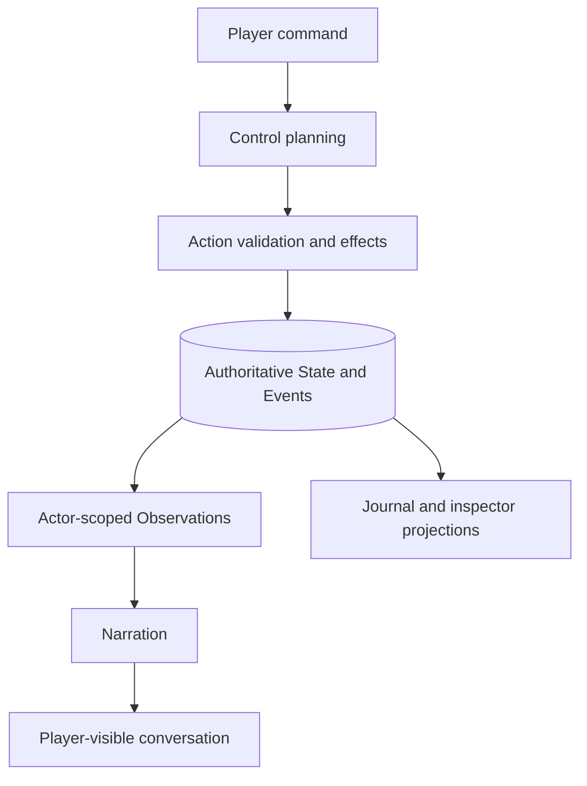

# Developer guide

This guide explains why Harness Tavern is built the way it is, how the repository is organized, how a turn moves through the system, and what a contribution must prove before it is merged.

Read [Architecture](ARCHITECTURE.md) alongside this guide when changing a cross-cutting runtime contract. Read [Experience architecture](EXPERIENCE_ARCHITECTURE.md) before changing product language or navigation.

## The problem the project is solving

Conventional roleplay chat treats the transcript as both user interface and world model. That optimizes for a plausible continuation, but it makes several important properties unstable:

- prose can quietly rewrite whether an action succeeded;
- a character's intention disappears when it falls out of context;
- one character can learn another character's private information;
- retrying a failed request can repeat a world-changing effect;
- changing a prompt or model can change what the application considers true;
- a branch can contaminate the history it came from.

Harness Tavern separates these responsibilities. The model helps interpret intent and render prose; deterministic application code decides what can change authoritative State.



The architectural center is therefore not “chat with a better prompt.” It is a durable control loop around a causal state machine, with chat as one projection.

## Construction principles

These principles are product contracts, not implementation preferences.

| Principle | Required behavior |
|---|---|
| State is truth | Narration cannot directly create or overwrite world facts. |
| Actions own effects | Every authoritative change comes from a registered Action or another deterministic domain operation. |
| The player owns the player | The system does not invent the user's speech, thoughts, feelings, identity, consent, or successful actions. |
| Knowledge is scoped | Control, each actor, the player Journal, creator tools, and public shares receive different projections. |
| Intent is durable | Character activity comes from an owned active Agenda; prose cannot declare that Agenda complete. |
| Failure is resumable | A received command survives provider failure, and resume cannot replay committed effects. |
| History is branch-safe | A child Timeline sees its parent only through the recorded branch boundary. |
| Content is portable | Authored Story files use stable keys; exports do not depend on local database IDs or credentials. |
| Incomplete is not complete | Truncated, malformed, or contradictory model output never appears as an accepted final reply. |
| Complexity is progressive | Ordinary players use Tavern concepts; runtime and provider controls remain optional advanced surfaces. |

If a proposed feature weakens one of these contracts, it needs an explicit design discussion and an Architecture Decision Record rather than a local shortcut.

## System layers

```text
Browser and HTTP transport
└── src/server + public

Application composition and human-facing services
└── src/app + domain services

Tavern domain
└── Characters, Personas, Stories, Playthroughs, Timelines, Cast

Causal runtime
└── Context Builder, Control Loop, Action Registry, Observations, Agendas

Provider boundary
└── portable request → provider-specific protocol

Persistence and portable sources
└── SQLite, append-only Events, snapshots, encrypted vault, Story files
```

Dependencies point inward toward product contracts. HTTP handlers should not become the domain layer, provider adapters should not decide Story behavior, and browser components should not receive private runtime records simply because displaying a debug panel is convenient.

## Repository map

| Path | Responsibility |
|---|---|
| `src/main.js` | CLI entrypoint for serve, seed, and doctor commands. |
| `src/app.js` | Composition root that wires storage, providers, domain services, runtime, sharing, and HTTP contracts. |
| `src/domain/` | Normalization, creator workflows, journal projections, presets, repository-facing Tavern operations. |
| `src/runtime/` | Context assembly, control-plan contracts, Action resolution, reasoning policy, and durable turn execution. |
| `src/providers/` | Provider catalog and protocol adapters behind one portable completion seam. |
| `src/storage/` | SQLite schema/migrations and encrypted credential vault. |
| `src/story/` | Editable Story resource loading, validation, binding, compilation, and synchronization. |
| `src/sharing/` | Public projections, pack integrity, portable import/export, and identifier remapping. |
| `src/migrations/` | Preview-first migration from external formats such as SillyTavern. |
| `src/extensions/` | Strictly declarative templates, quick actions, and theme contributions. |
| `src/server/` | HTTP authentication, routing, request limits, static assets, and response serialization. |
| `public/` | Dependency-free browser application and public share page. |
| `schemas/` | Versioned portable JSON Schema contracts. |
| `examples/` | Checked-in authoring examples that must remain valid inputs. |
| `tests/` | Deterministic domain, runtime, provider, HTTP, migration, sharing, and usability tests. |
| `scripts/` | Repository checks, user-journey verification, Story CLI, live opt-in checks, and release construction. |
| `docs/` | User, creator, architecture, developer, API, security, and operations documentation. |

## A turn from request to narration

Understanding this sequence prevents most architectural mistakes.

### 1. Receive and persist the command

The runtime claims the Conversation lock and persists the player Command with idempotency, command, correlation, and causation identifiers. Once accepted, the command is durable even if every later provider call fails.

### 2. Project the selected history

The runtime reads the Story definition, Persona, Cast, and selected Timeline. Event reduction reconstructs current messages, world state, relationships, goals, commitments, Agendas, clocks, and continuity summary. A branch reads parent events only through its event boundary.

### 3. Build Director context

The Context Builder assembles typed blocks instead of concatenating one uncontrolled prompt. It records which blocks were selected or omitted. Context budgets are optional; an explicit budget chooses whole blocks and never slices through text.

### 4. Request a Control Plan

The provider returns structured intent, not authoritative effects. Top-level proposed Actions belong to the player. A Character can act only through an active Agenda that it owns. The planner may choose to act or defer, but it cannot mark persistent Intent complete, failed, paused, or resumed.

### 5. Resolve Actions deterministically

The Action Registry checks:

1. actor permission;
2. parameter JSON Schema;
3. authored preconditions against the current projection;
4. deterministic effects;
5. actor-scoped Observation templates.

Only this stage commits Action effects. Rejected actions produce receipts without changing facts.

### 6. Evaluate Agenda lifecycle

Story-authored `complete_when`, `fail_when`, `pause_when`, and `resume_when` conditions are evaluated against authoritative facts. Story Agendas replace generic Character Card goal loops for the same owner in that Story; card goals remain a fallback elsewhere.

### 7. Narrate from visible outcomes

Each selected speaker receives only the facts, lore, private context, and Observations visible to that actor. Narration is a rendering pass. It cannot call an Action or write State.

Complete prose that contradicts a committed open/closed transition is recorded as discarded usage and retried once. If the retry still conflicts, the runtime renders a safe fallback from verified Observations. Provider-truncated or malformed output suspends the loop instead of creating a partial message.

### 8. Commit completion

Accepted messages, usage, completion events, and a deterministic State snapshot are appended. The lock is released only when the loop reaches a quiescent phase. Resume starts from the durable phase and does not repeat previously committed effects.

For exact event and API contracts, see [Architecture](ARCHITECTURE.md) and [API](API.md).

## Authored Story files and runtime State

`harness-tavern-story/v2` is the canonical authoring boundary. It supports:

- one self-contained `*.story.tavern.json` file;
- or `story.tavern.json` plus relative Character, Lorebook, Markdown Scene, Action, and Agenda resources.

SQLite is the validated runtime projection, not a replacement for editable authored content. Conversations, events, Playthrough state, provider settings, and credentials never write themselves back into Story sources.

The source compiler enforces JSON Schema, semantic references, stable keys, and path containment. A malformed manual edit leaves the last valid runtime projection available and reports a source error. Browser saves use a content digest for optimistic concurrency.

Before changing a Story contract, read [Editable Story sources](STORY_SOURCES.md) and validate both the compact and project forms.

## Provider design

Provider adapters translate a portable generation request into one external protocol. Product policy remains outside the adapter.

A provider contribution should:

- implement completion and model-catalog behavior through the existing seam;
- map portable options only when the protocol supports them;
- keep model, messages, reasoning, structured output, tools, and output-limit fields protected from arbitrary provider JSON overlays;
- classify content truncation and context-window failures as incomplete;
- redact authorization material and private prompt content from errors and logs;
- use a captured local endpoint in automated tests;
- keep live paid-provider verification explicit and opt-in.

Some protocols require an output-limit field. That protocol requirement must be documented and its stop reasons handled; it must not become silent acceptance of partial prose.

## Browser architecture

The browser client under `public/` intentionally uses no build framework. This keeps installation small and lets the shipped files be inspected directly. It does not relax separation rules:

- `public/lib/api.js` owns transport helpers;
- `public/lib/dom.js` owns small DOM utilities;
- `public/lib/i18n.js` owns interface strings and locale behavior;
- `public/app.js` owns application state and view orchestration;
- `public/share.js` renders the independent public-share surface;
- `public/styles.css` defines the responsive visual system.

Player prose remains visually primary. Advanced causal information belongs in the inspector and collapses to a drawer on small screens. New navigation labels should use Character, Story, Persona, Playthrough, Timeline, Journal, and Share rather than exposing internal provider or agent vocabulary.

## Local development setup

### Prerequisites

- Node.js 22.19.0 or newer;
- npm 10.9.3 or a compatible npm 10 release;
- Git;
- Docker with Compose only when validating the container path.

The pinned Node baseline is in [`.nvmrc`](../.nvmrc). Runtime dependencies are deliberately small: Ajv validates portable schemas and fflate handles bounded archives.

### First checkout

```bash
git clone https://github.com/HenryQUQ/harness-tavern.git
cd harness-tavern
nvm use
npm ci
npm run verify
npm start
```

The server listens on `http://127.0.0.1:8787` by default.

### Keep development data isolated

Do not point experiments or automated checks at a personal Tavern database. Use a task-specific directory:

```bash
export HT_DEV_DATA_DIR="$(mktemp -d)"
HT_DATA_DIR="$HT_DEV_DATA_DIR" npm run seed
HT_DATA_DIR="$HT_DEV_DATA_DIR" npm run dev
```

Remove the temporary directory only after confirming that it contains no data you need. Tests and journey scripts already create their own isolated temporary stores.

Harness Tavern reads environment variables directly and does not load `.env` files itself. [`.env.example`](../.env.example) documents supported settings. Inject credentials through the shell, process manager, or application vault; never commit them.

## Commands

| Command | Purpose |
|---|---|
| `npm start` | Start the application. |
| `npm run dev` | Start with file watching and debug logging. |
| `npm run check` | Validate syntax, JSON, local documentation links, repository hygiene, Action pinning, and credential patterns. |
| `npm test` | Run the deterministic test suite. |
| `npm run test:coverage` | Run source coverage with enforced thresholds. |
| `npm run verify:journey` | Exercise the complete fresh-user HTTP journey. |
| `npm run doctor` | Check database integrity, inventory, and Story source bindings. |
| `npm run story:validate -- <path>` | Validate one editable Story file or project. |
| `npm run story:import -- <path>` | Link and compile an editable Story source. |
| `npm run story:export -- <story> <path> [--project]` | Export compact or multi-file Story source. |
| `npm run verify:deepseek` | Run the explicit live DeepSeek causal scenario; never use it in CI. |
| `npm run verify` | Run the local merge gate: CI-equivalent checks plus doctor. |
| `npm run release` | Build and cold-test release artifacts from the current commit. |

## How to contribute

The short repository entrypoint is [CONTRIBUTING.md](../CONTRIBUTING.md). The complete workflow is below.

### 1. Start with a bounded outcome

Use [GitHub Discussions](https://github.com/HenryQUQ/harness-tavern/discussions) for open-ended product or architecture exploration. Use [GitHub Issues](https://github.com/HenryQUQ/harness-tavern/issues) for a reproducible defect or a feature with a clear acceptance boundary.

Before coding, identify:

- the user-visible outcome;
- the authoritative data or contract that changes;
- the privacy audiences involved;
- compatibility and migration impact;
- the proof needed to call the work complete.

Large cross-cutting changes should be discussed before implementation. Security reports must follow [SECURITY.md](../SECURITY.md), not a public issue.

### 2. Create a focused branch

```bash
git fetch origin
git switch main
git pull --ff-only origin main
git switch -c feat/short-outcome
```

Use a short-lived branch and keep unrelated changes out of the pull request. Conventional Commit prefixes are encouraged: `feat:`, `fix:`, `docs:`, `test:`, `refactor:`, `build:`, and `ci:`.

### 3. Trace the contract before editing

Find the path from the user action to storage and back to the visible projection. For a runtime change, inspect Command persistence, context assembly, Action resolution, Events, reduction, and player sanitization. For a portable format, inspect preview, validation, conflict planning, transactionality, export, and round-trip tests.

Avoid solving a domain problem only in the browser or an HTTP handler. A UI-only restriction is not an authorization boundary, and a prompt-only rule is not a causal invariant.

### 4. Implement the smallest coherent change

- preserve existing persisted data unless an explicit migration is included;
- keep provider-specific logic in `src/providers/`;
- keep deterministic effects out of model prose;
- update all projections when a field has different player, creator, and private representations;
- reject unknown executable import fields;
- use built-in Node.js capabilities unless a dependency has a clear security and maintenance benefit;
- update documentation in the same change when behavior or contracts move.

### 5. Add proof at the right layers

At minimum, add a regression test that fails without the change. Cross-cutting behavior usually needs more than one layer:

| Change | Expected evidence |
|---|---|
| Domain normalization or projection | Focused unit test plus privacy edge cases. |
| Runtime or Action behavior | Success, rejection, retry/resume, and State/Event assertions. |
| Provider adapter | Captured outbound request, normalized response, error and truncation cases. |
| HTTP contract | Authentication, validation, success response, and sanitized failure. |
| Import/export | Preview, conflict strategy, atomic rollback, round trip, and hostile input. |
| Story schema | Compact file, multi-file project, semantic failure, and compatibility case. |
| Browser workflow | Relevant HTTP/journey assertion and responsive visual check when layout changes. |
| Documentation | `npm run check` with all relative links resolvable. |

Automated tests must not contact a paid model, depend on a personal database, or expose credentials. Live verification is additional evidence, never a replacement for deterministic tests.

### 6. Run the merge gate

```bash
npm run verify
npm audit --omit=dev --audit-level=high
git diff --check
```

For Story-format work, also run:

```bash
npm run story:validate -- examples/stories/midnight-at-the-glass-observatory
```

Use `npm run release` only when release construction changed or a release candidate needs cold-extraction evidence.

### 7. Open a pull request

The pull request should lead with the outcome and include:

- the scoped changes;
- validation commands and exact results;
- screenshots for visible UI changes;
- API or portable-format examples when a contract changed;
- privacy, security, migration, and rollback impact;
- any remaining limitation stated as a limitation, not hidden in future work.

Wait for the required **Quality gate**. A pending check is not a passing check. Resolve review conversations and update the branch normally; do not force-push shared work without coordination.

## Test architecture

The suite uses Node's built-in test runner and isolated temporary databases.

- `tests/causal-runtime.test.js` protects State, Actions, Observations, Agendas, contradiction handling, long narration, and resume behavior.
- `tests/runtime.test.js` covers context assembly and core turn behavior.
- `tests/providers.test.js` captures provider protocol mapping without external traffic.
- `tests/http.test.js` covers transport and browser-facing contracts.
- `tests/migration.test.js` covers SillyTavern previews, archive safety, atomic apply, and warnings.
- `tests/story-sources.test.js` covers Story v1/v2, compact/project forms, source binding, and file synchronization.
- `tests/sharing.test.js` and `tests/portable-playthrough.test.js` cover projection safety, integrity, remapping, and rollback.
- `tests/experience.test.js` and `tests/usability-and-portability.test.js` protect player language and complete journeys.
- `scripts/verify-user-journey.js` executes a fresh user path across real HTTP boundaries.

Coverage thresholds apply to `src/**/*.js`: 85% lines, 80% functions, and 65% branches. They are minimum gates, not a reason to add assertions without behavioral value.

When a test fails, prefer asserting durable outcomes—Events, State revision, receipts, projections, or provider envelopes—over timing or incidental HTML structure.

## Database and event evolution

Schema creation and compatible migrations live in `src/storage/database.js`. A database change must:

1. preserve existing local data;
2. be idempotent on repeated startup;
3. include a test that starts from the previous shape;
4. keep credential key material separate from SQLite;
5. preserve stable event interpretation or add an explicit versioned migration;
6. update backup, restore, and rollback documentation when required.

Append-only event payloads are compatibility contracts. Prefer adding optional versioned fields over changing the meaning of existing fields. Projection changes must be deterministic when replaying the same lineage.

## API and portable format evolution

HTTP and pack changes should be previewable, validated, and explicit about compatibility.

- use structured error codes rather than parsing messages;
- sanitize player responses separately from creator responses;
- keep imports transactional at their documented boundary;
- remap local identifiers during portable import;
- include a format version and reject unsupported semantics clearly;
- never place credentials or credential ciphertext in a portable export;
- update [API](API.md), [Sharing and extensions](SHARING_AND_EXTENSIONS.md), schemas, examples, and round-trip tests together.

## Documentation and decisions

The documentation index is [docs/README.md](README.md). Update the page owned by the behavior you changed, keep commands runnable from the repository root, and use relative links.

Create an ADR under `docs/adr/` when a decision:

- changes a long-lived product or trust boundary;
- introduces an irreversible compatibility trade-off;
- chooses between multiple credible architectural directions;
- constrains future storage, provider, runtime, or deployment work.

An ADR records context, decision, consequences, and rejected alternatives. It does not replace implementation tests or user documentation.

## Debugging without damaging real data

Start with read-only evidence:

```bash
npm run doctor
curl --fail http://127.0.0.1:8787/api/health
```

Use a temporary `HT_DATA_DIR` for reproduction. Inspect redacted request identifiers, provider finish reasons, loop phase, Action receipts, Event lineage, and State snapshots. Do not log authorization headers, decrypted credentials, raw private prompts, or complete personal transcripts.

For a suspended turn, determine the failed phase before retrying. A control failure occurs before Action effects; a narration failure may occur after facts were committed. Resume through the runtime contract rather than manually editing events.

## Release process

1. Update `CHANGELOG.md`, `package.json`, `package-lock.json`, and `src/version.js` together for a versioned release.
2. Merge a green pull request to `main`.
3. Create and push an annotated `vX.Y.Z` tag.
4. The release workflow reruns checks, coverage, the fresh-user journey, database diagnosis, audit, cold archive extraction, checksums, and Git bundle validation before creating a GitHub Release.

Release generation reads the current commit. It must not rewrite Git history, invent a tag, include local data, or mutate a user's Tavern.

## Definition of done

A contribution is complete when:

- the requested user or engineering outcome works end to end;
- authoritative State and privacy boundaries remain correct;
- failure, retry, migration, and compatibility paths are handled in proportion to risk;
- deterministic tests cover the changed behavior;
- `npm run verify`, dependency audit, and `git diff --check` pass;
- user and developer documentation match the implementation;
- the pull request states evidence and remaining boundaries honestly;
- required GitHub checks are complete and successful.
